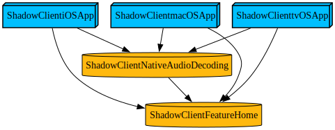

# shadow-client

Native Apple-platform game streaming client for Sunshine, intended as a Moonlight alternative on Apple devices.

## Focus

- Sunshine protocol correctness with Moonlight-compatible behavior where interoperability matters
- low-latency native decode and rendering on Apple platforms
- stable recovery under packet loss, decoder faults, and display-mode transitions

## Project Layout

Tuist is the source of truth for targets and dependency wiring.



```bash
tuist graph ShadowClientmacOSApp ShadowClientiOSApp ShadowClienttvOSApp ShadowClientFeatureHome --skip-test-targets --skip-external-dependencies --format svg --no-open --output-path docs
```

Relevant source roots:

- `Projects/App/Features/Home`: session runtime, protocol/client implementation, and platform glue
- `Projects/App/iOS`, `Projects/App/macOS`, `Projects/App/tvOS`: platform app entrypoints
- `Projects/App/Tests`: app-level Swift Testing suites and compile-gate coverage
- `Modules/`: reusable package modules

## Validation

Default validation order:

1. `ShadowClientmacOS` build
2. `ShadowClientTests` iOS Simulator compile gate
3. `Modules` Swift package tests

```bash
tuist install
tuist generate --no-open
xcodebuild build -workspace shadow-client.xcworkspace -scheme ShadowClientmacOS -destination 'platform=macOS'
xcodebuild build -workspace shadow-client.xcworkspace -scheme ShadowClientTests -destination 'generic/platform=iOS Simulator' CODE_SIGNING_ALLOWED=NO CODE_SIGNING_REQUIRED=NO
cd Modules && swift test
```

## Platform Notes

- macOS is the primary validation target.
- iOS and iPadOS explicitly end active sessions when the app enters background.
- `SwiftOpus` is pinned through Tuist to the public `0.3.0` release tag.
